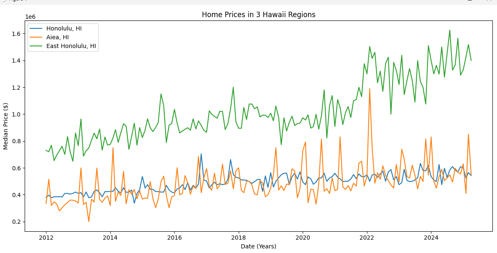

In this project I am relearning how to plot data using python, pandas, matplotlib, and Numpy.
I used real world data using Hawaii Home prices from 2012-2025. 
I also implemented a linear regression model using Scikit-learn to help try and predict home prices for Honolulu in the next year, which is something new for me.
I also learned to clean and reshape the data using functions like melt.
At the end I compared the home prices from 3 different areas and plotted the comparison.
Honolulu price forecast 
Comparison graph 
